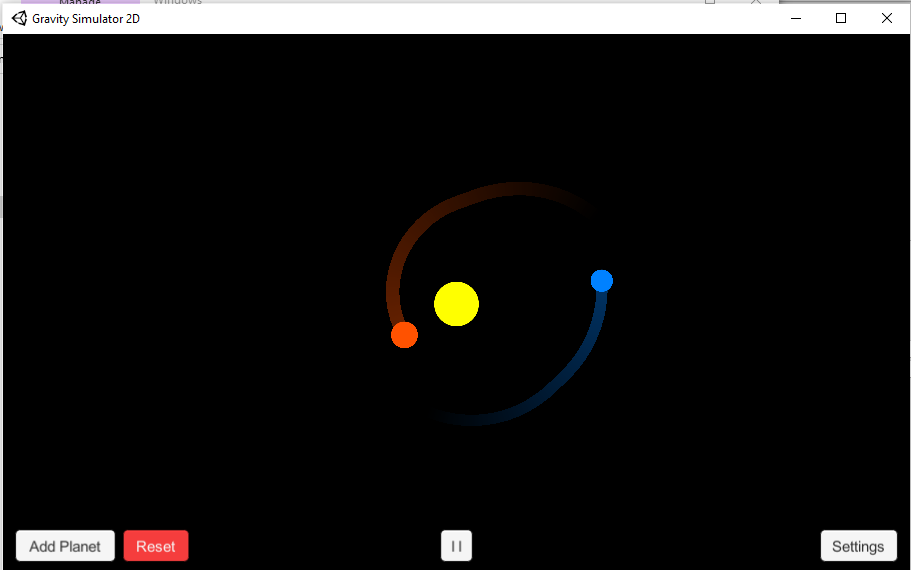
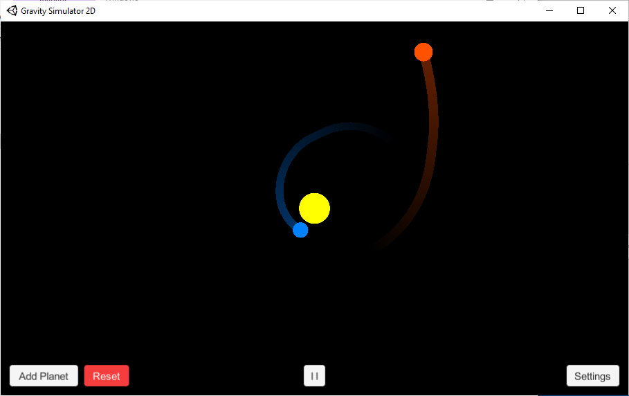
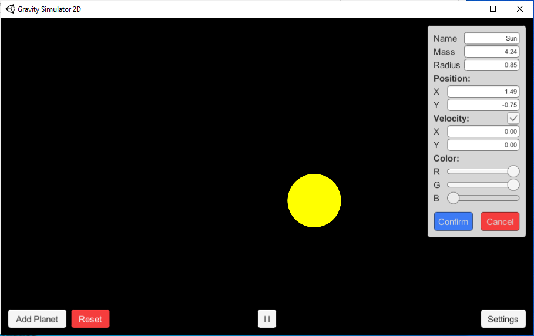

# Gravity Simulator 2D
 
### A software to simulate effect of gravity on planets, stars etc.

 
 
 

## Build Requirements:
 - Unity3D (Tested on version 2021.3.18f1)
 - C# IDE (Visual Studio, Visual Studio Code, Rider etc.)

## Build Steps:
 - Open Unity Hub
 - Click "Add"
 - Select the folder downloaded from repository
 - After project launched, go to "File" > "Build And Run"
 